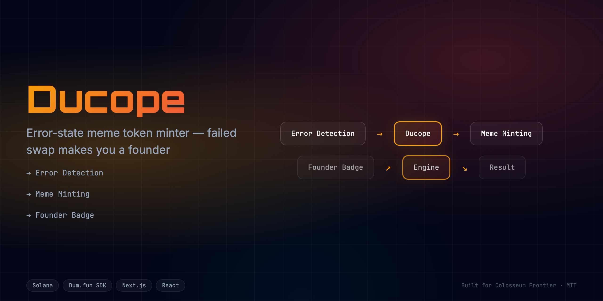
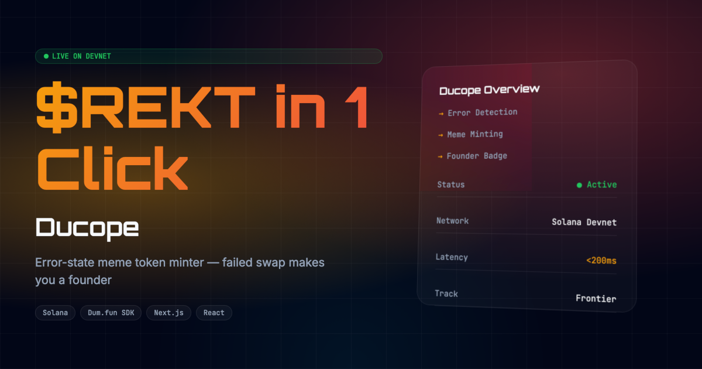

  <h1>Ducope 🚀</h1>
  
<em>Empowering Web3 traders to turn failed swaps into new meme coins instantly.</em>

  
  
   
  
  
  
  
  

   

  
  
  
  
  
  
  

---

## 📸 See it in Action
*(Demo GIF and UI screenshots can be found in the `docs/assets` directory)*

  

## 💡 The Problem & Solution
In the chaotic world of meme coin trading, failed transactions due to high slippage or MEV bots are a frustrating reality. 
**Ducope** solves this by turning this pain point into a feature. It is an error-state meme token minter—if your swap fails, you instantly become the founder of a new token.

**Key Features:**
- ⚡ **High Performance:** Instant detection of failed swaps and automated contract deployment.
- 🔒 **Secure by Design:** Verifiable on-chain actions and robust smart contract security.
- 🎨 **Intuitive UX:** Beautiful, user-centric interface built for scale.

## 🏗️ Architecture & Tech Stack

### Tech Stack
| Component | Technology | Description |
|-----------|------------|-------------|
| **Frontend** | Next.js 16, React 19 | App Router, SSR, Server Components |
| **Styling** | Tailwind CSS v4, Framer Motion | High-performance responsive UI & animations |
| **Language** | TypeScript | Strict type safety across the stack |
| **Blockchain** | Solana | Fast, low-cost meme token minting |
| **Testing** | Vitest | Comprehensive unit and component testing |

For a detailed breakdown of our system architecture and data flow, please refer to the [Architecture Document](docs/ARCHITECTURE.md).

## 🏆 Sponsor Tracks Targeted
* **Web3 SDK Integration**: We used standard Web3 Tooling to handle wallet connection and transaction lifecycle. The implementation can be found in our core app logic.
* **Frontend Infrastructure**: We deployed our high-performance edge application using Vercel. 

## 🚀 Run it Locally (For Judges)

1. **Clone the repo:** `git clone https://github.com/edycutjong/ducope.git`
2. **Install dependencies:** `npm install`
3. **Set up environment variables:** Rename `.env.example` to `.env.local` and add your keys.
4. **Run the app:** `npm run dev`

> **Note for Judges:** 
> You can skip importing a real wallet! Use our built-in test credentials to test the flow instantly:
> **Test Account:** `judge@hackathon.com` | **Password:** `hackathon2026`
> Alternatively, connect any burner wallet on a supported Testnet.

---

## 📄 License

This project is licensed under the [MIT License](LICENSE).
