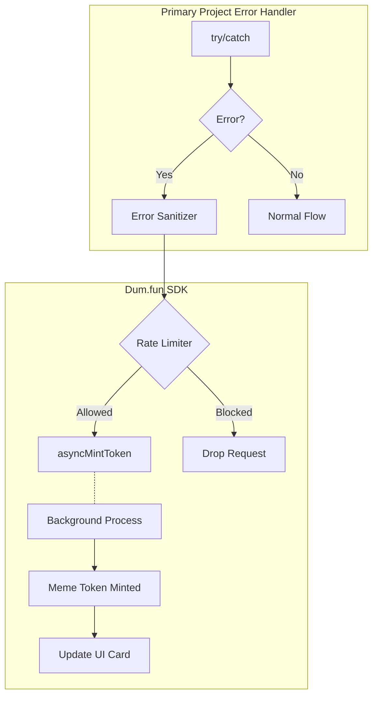

# Ducope — Technical Architecture (V2 Production)

## System Architecture



## Integration Map

| Feature | Use Case | Depth |
|---|---|---|
| **asyncMintToken()** | Mint meme token async on error | 🟢 Core |
| **ErrorHandler** | Scrub sensitive data from errors | 🟢 Core |
| **RateLimiter** | Prevent wallet/error spamming | 🟢 Core |

## Implementation (15 min)

```javascript
// Wrap any error handler in primary project
try {
    await executeSwap(params);
} catch (err) {
    // 1. Instantly feedback to user
    showToast(`Swap failed. Minting your $REKT cope token in background...`);
    
    // 2. Mint token asynchronously (non-blocking)
    dumfun.asyncMintToken({
        wallet: userWallet.address,
        error: err
    }).then(cope => {
        if (cope) {
            updateToast(`Minted ${cope.ticker}! You're now a founder!`);
        }
    }).catch(console.error);
}
```
