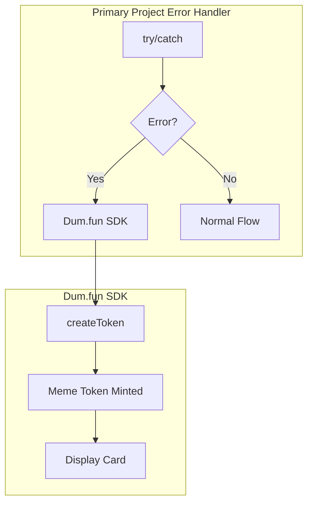

# Ducope — Technical Architecture

## System Architecture



## Integration Map

| Feature | Use Case | Depth |
|---|---|---|
| **createToken()** | Mint meme token on error | 🟢 Core |

## Implementation (15 min)

```javascript
// Wrap any error handler in primary project
try {
    await executeSwap(params);
} catch (err) {
    const cope = await dumfun.createToken({
        name: "REKT",
        description: `Swap failed: ${err.message}`,
        image: generateMemeImage(err)
    });
    showToast(`Minted $REKT — you're now a founder!`);
}
```
